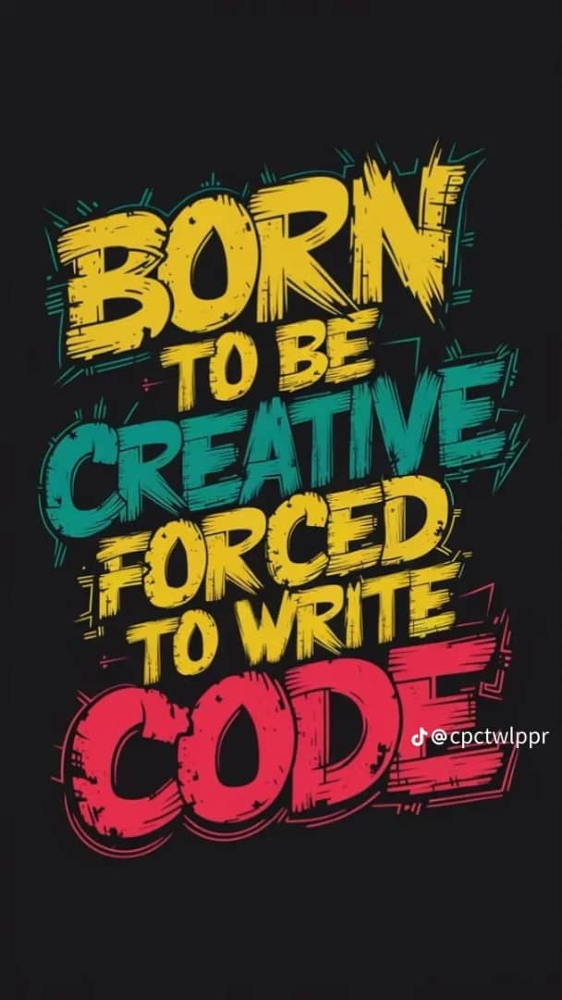
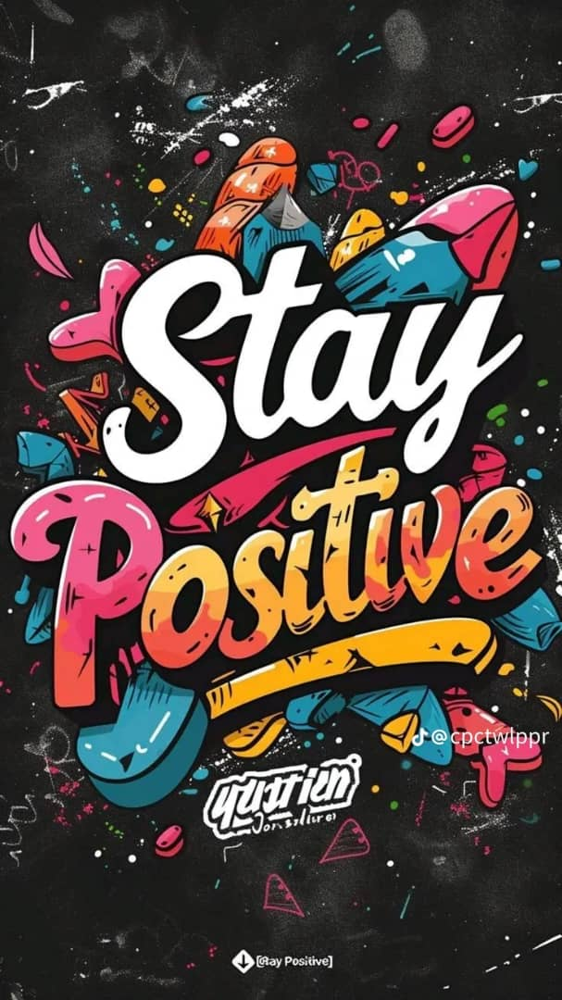

<!DOCTYPE html>
<html lang="en">
<head>
    <meta charset="UTF-8">
    <meta name="viewport" content="width=device-width, initial-scale=1.0">
    <title>Awesome Landing Page</title>
    
</head>
<body>
    

        

            <nav class="nav">
                

                

                    <a href="firstname.html">First Name</a>
                    <a href="secondname.html">Second name</a>
                    <a href="id.html">Id Number</a>
                

            </nav>
            

                

                    <h1>The Reality Of The Nature</h1>
                    
 The relity of the nature is a topic that has puzzled philosophers for centuries.

                    <a href="#" class="button">Sign up</a>
                

                

                    
                

            

        

    

    

        

            <h2 style="font-family: Georgia, 'Times New Roman', Times, serif;">Some random information.</h2>
            

                

                    

                    
What is The Nature of Reality? It’s a blog, and it’s pretty much the biggest question.

                

                

                    

                    
Reality can be defined in a way that links it to worldviews or parts of them conceptual frameworks

                

                

                    

                    
Reality is the totality of all things, structures, events , and phenomena.

                

                

                    

                    
Out of all the realities, the reality of everyday life is the most important one since, our consciousness

                

            

        

    

    

        

            
Reality is the sum or aggregate of all that is real or existent within the universe, as opposed to that which is only imaginary, nonexistent or nonactual. The term is also used to refer to the ontological status of things, indicating their existence.

            
<b>Reality Of The Nature</b>>

        

    

    

        

            

                

                    <h3>Call to action! It's time!</h3>
                    
Sign up for our product by clicking that button right over there!

                

                <a href="#" class="button cta-button">Sign up</a>
            

        

    

    <footer class="footer">
        

             @to Bernard 2024
        

    </footer>
</body>
</html>
